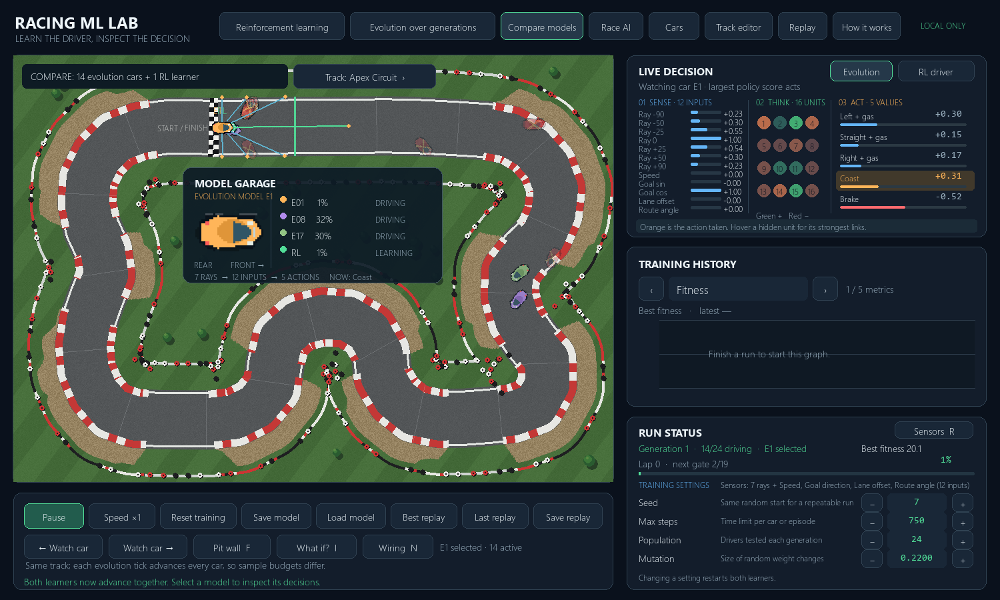
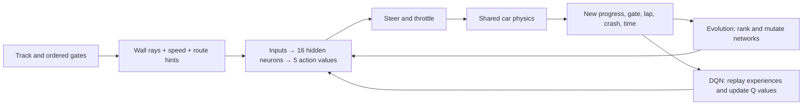

# Racing ML Lab

**A hands-on machine-learning simulation by @darkspaz-v1.** Watch a 2D driver read sensor rays, choose an action, hit a wall or pass an ordered gate, and improve across runs. Train two independent learners on the same course: an evolutionary neural network and a Deep Q Network (DQN). The app runs locally and has no network connection.



[Car garage: four bodies and eight paints](assets/car-garage.png) · [Switchback Park](assets/switchback-preview.png) · [Smoothed race controls](assets/race-controls.png) · [Pit wall: every car's live state](assets/pit-wall.png) · [Decision sandbox](assets/decision-sandbox.png) · [Network wiring](assets/network-wiring.png) · [Sensor setup](assets/sensor-setup.png) · [DQN curve](assets/dqn-learning.png)

## Start here

Requires Python 3.11–3.13. On Windows PowerShell:

```powershell
cd racing-ml-lab
python -m venv .venv
.\.venv\Scripts\python.exe -m pip install -r requirements.txt
.\.venv\Scripts\python.exe run.py
```

On macOS or Linux, replace `.\.venv\Scripts\python.exe` with `./.venv/bin/python`. The display is 1500 × 900 pixels. The only runtime dependencies are NumPy and pygame-ce; `pytest` is needed for the tests.

Start on **Evolution over generations** to see all 24 candidate cars driving at once. Click a car on the track or use **Watch car** to inspect its own sensors and network. **Reinforcement learning** trains the DQN driver; its initial random exploration is deliberate. **Compare models** advances both methods together on the same track, with an inspector switch for choosing which network to study. One evolution tick advances the whole population, so the side-by-side animation does **not** give the algorithms equal experience budgets. Return to speed ×1 to see each decision. Use **How it works** for an in-app summary.

## Try the interactive tour

1. Open **Evolution over generations** and click a car. Its rays, hidden units, and action values appear in the inspector. Use **Pit wall** or press **F** to see all cars and click another one. The **Rank view** button orders cards by laps and progress; **ID view** keeps car positions stable.
2. Press **I** or choose **What if?**. Pick any input and drag the slider. Watch a copy of the network that made that decision recalculate all five action values. **Baseline** shows its output for the recorded input; **What if** shows the hypothetical output. Close with **Esc**. This probe pauses training and cannot move the car or update the model.
3. Press **N** or choose **Wiring** for the classic nodes-and-links view of the whole network: every input, 16 hidden units, 5 actions, and every weighted connection between them. Green links add, red links subtract, and brighter means a larger weight. Hover any node to hide every connection except its own. Close with **Esc**.
4. Press **R** or choose **Sensors** to change what the car can sense: 0 to 15 rays, plus any mix of the four extra inputs. Watch the fan preview change, then **Apply & restart** to retrain both learners with a network sized to match. The results table keeps every earlier setup's numbers on the same track so you can compare them. Use the **Track** button above the course to switch circuits.
5. Open **Reinforcement learning** and repeat the probe. The recorded DQN action may differ from its largest Q value because training sometimes explores randomly. Switch to **Compare models** to watch both learners on the same course.
6. Choose **Cars** or press **C**. Pick one of four silhouettes and eight paint colors separately for your race car and the AI fleet. Appearance is deliberately cosmetic: it cannot change physics or learning results.
7. Choose **Race AI**. Human steering ramps toward the key direction instead of snapping to full lock. Start with **Gentle**, then click the steering button for Balanced or Direct response if you want more speed. The live speed, steering, and gas values show exactly what your keys are commanding.

## The system at a glance



By default seven blue/green rays report free road ahead at −90°, −50°, −25°, 0°, +25°, +50°, and +90°. The **Sensors** panel can use anywhere from 0 to 15 rays, spread evenly across the same 180° arc (the seven-ray fan keeps its original hand-picked angles so the measured baseline still reproduces exactly). Each frame records the car's pose *before* it acts, so the rays align with the inputs that actually produced that decision; the car artwork shows where it moved afterward. The other five inputs are speed, sine/cosine of the angle to the next gate, signed distance from the road centerline, and angle relative to the local road direction. These last inputs are *route hints* supplied by the simulation; they make the driving task learnable without hiding information from one algorithm. Both learners always see the same numbers, and each extra input can be switched off: with all four on and seven rays that is 12 inputs, which is the default. Switching inputs off is an experiment worth running rather than one with a predictable answer: in the [measured comparison](docs/experiment-notes.md#sensor-comparison-on-apex-circuit), removing the route hints did not slow evolution down, but removing every ray stopped it from ever finishing a lap. A network is sized to its inputs, so changing the setup restarts training rather than reusing weights that no longer fit.

The five outputs correspond to **left + gas, straight + gas, right + gas, coast, and brake**. In evolution, a score simply ranks those actions; the greatest score wins. In DQN, each number estimates the discounted future reward (a **Q value**) of taking that action. During training DQN sometimes chooses a random action instead, controlled by ε (epsilon). The orange output is the *action actually taken*, including random exploration.

### What counts as improvement?

The car must cross gates **in order and in the forward direction**. Crossing gate 3 before gate 2 earns no checkpoint. A lap is recorded only after every gate and then the start/finish gate. Forward-progress reward is given only when the car reaches a new furthest distance within its current gate interval. Reversing or oscillating cannot repeatedly collect it. A crash ends the run. A step has a small time cost, so sitting still is not an attractive solution.

The DQN reward for each step is `0.025 × new distance + 4 × crossed gate + 40 × completed lap − 0.012 − 8 if crashed`. The **evaluation score**, used to compare final drivers, is separate: `100 × cumulative progress in laps + 100 × completed laps − 0.015 × steps − 5 if crashed`. The extra lap term rewards fully finished circuits. Evolution selects parents using the evaluation score. These numbers are design choices, not universal ML rules; change them in `racing_lab/simulation.py` and observe what happens.

## The two learners

| | Evolution | DQN |
|---|---|---|
| Unit of training | A population of complete policies | One policy updated from individual steps |
| Feedback | Whole-run score | Step reward and predicted future value |
| Exploration | Mutated weights in offspring | Random actions with probability ε |
| Memory | The best parents and best replay | A buffer of 20,000 transitions |
| Update | Copy two elites; mutate selected parents | Sample a batch, calculate target Q values, backpropagate |
| Typical pace here | Several generations can produce laps | Hundreds of episodes may be needed |

Evolution starts with random networks. **All cars in a generation advance together**, with separate observations, actions, crashes, and lap progress. You can watch any one of them without changing how the others train. After every car finishes, the top two networks are kept unchanged. The rest are mutations of networks selected from the best quarter. This is a deliberately simple genetic algorithm: there is no crossover, and the full neural-network weights are the genome.

DQN stores `(state, action, reward, next state, done)` after each step. Every fourth step, it samples old transitions, computes a target from a periodically copied **target network**, and updates the online network with a clipped-error gradient. It discounts future rewards by 0.97. ε begins at 1, multiplies by 0.997 after each episode, and stops at 0.05. Every tenth episode is followed by a separate **greedy evaluation** without random actions or weight updates. The saved "best" network and replay come from these evaluations, so a lucky exploratory episode cannot masquerade as a capable deployable driver. At the default settings, DQN may take roughly 600 or more episodes to complete laps. That is a learning curve, not an app freeze. The chart is more useful than a single lucky run.

### Reading the dashboard

- **Track:** each colored top-down car is a separate evolution policy. The orange car is the one currently being inspected; the green car is the DQN learner in Compare models. Blue/green rays measure the inspected car's wall distance, orange dots mark where rays end, green marks the next gate, and red marks a crash. Every car has the same physics and start position.
- **Circuit art:** the physics road is painted as a tabletop-style course with grass, light asphalt, red and white curbs, gravel traps, tire stacks, trees, and a chequered line. Decoration always stays outside the drivable mask, so the visual road edge and collision edge agree.
- **Car garage (key `C`):** choose Touring, Formula, Rally, or Prototype bodies and eight paint colors. Your race car and the AI fleet have separate selections. The AI body appears on every learning car while their colors continue to identify separate models. Choices are remembered locally in ignored `data/preferences.json` and never change a model file.
- **Model garage:** a magnified view of the inspected car, the current driving action, and a small live roster of other cars and their progress. This is a larger view of the actual Pygame car artwork; its body aligns with the simulation's collision box.
- **Pit wall:** a live, clickable view of the entire evolution population, including finished and crashed cars. The board pages through larger populations and can rank cars by laps and ordered progress. The RL driver appears separately in Compare models because it is one continually updated model rather than a member of the evolution population.
- **Live decision:** read from left to right. The input bars show the numbers the car senses (a bar fan for the rays once there are more than seven), the 16 numbered circles show hidden-layer activity (green positive, red negative), and the action bars show the five output values. Orange marks the action actually taken. In evolution the outputs are policy scores; in DQN they estimate future reward. DQN may take a random exploratory action even when another Q value is larger. Hover a hidden unit to see its strongest current input contribution and output link. Replay shows recorded activity and action; historical weights are not saved.
- **Network wiring (key `N`):** the whole network as nodes and links — the compact panel above shows *values*, this shows *structure*. Node fill is the current value; line colour is the learned weight, so the diagram redraws as training changes the weights. Hovering a node isolates its connections, which is the only practical way to follow one path through 272 lines (up to 400 with 20 inputs). Replays store node values and the action taken but not that moment's weight matrices, so the links are drawn grey there.
- **Decision sandbox:** captures one observation and a *copy* of the network that made that decision, before any DQN update. Changing an input recomputes the hidden layer and output scores without taking a simulation step. The recorded action, baseline highest score, and hypothetical highest score are displayed separately. Inputs can describe situations that cannot occur on a real track, so the sandbox explains the network's arithmetic rather than predicting a realistic future trajectory.
- **Training history:** use the arrow buttons to cycle through score, progress, lap completion, crash rate, best lap time, and DQN reward. Blue is each generation or episode; green is a trailing 10-run mean. DQN's score chart uses greedy evaluations every tenth episode, with an orange line for the best saved checkpoint; its other charts show exploratory training episodes. An empty lap-time graph means no completed lap yet. DQN can improve and later regress, which is why the best evaluated network is saved separately.
- **Run status:** current generation/car or episode/ε/replay-memory size, a progress bar, next gate, and learning settings. Changing a setting resets both learners so subsequent comparisons use the same track and seed.

## Make a track, race, and inspect a replay

1. Choose **Track editor**. Drag existing points or choose **Clear** and click at least five points around a closed route. The first point is the start. Select another point and choose **Set start** to move it. Right-click a point to remove it.
2. Choose **Gate tool** and click on the road to add a gate; right-click a gate to remove it. If you leave gates on automatic, they are evenly spaced. The start gate always stays at position zero. Adjust width with **Width −/+**. Choose **Apply track** to validate and train on it. **Save/Open** use JSON files.
3. Train a driver, then choose **Race AI**. Hold Up/W for gas, use Left/A and Right/D to steer, and Down/S to brake. Keyboard steering and throttle ease in over several frames, and **Gentle**, **Balanced**, and **Direct** modes change response without changing AI physics. Cars are ghosts to each other: they race the track but do not collide with each other.
4. Choose **Best replay** to study the strongest recorded run or **Last replay** to inspect a recent crash. Pause, play, or move one or 60 frames at a time. **Save replay** saves whichever type you last selected. **Open replay** loads a saved JSON recording with its track and settings.
5. **Save model** writes a compressed `.npz` with network weights, algorithm, seed, settings, training track, and best score. **Load model** keeps the *current* track so you can race a saved driver on a different course. The source track stays in the model metadata; a score from that source track is not presented as an evaluation of the new track. Its replay memory is fresh when training resumes.

Four tracks are in `data/tracks/`. **Apex Circuit** is the default: a long main straight, sweeping corners, and a tight hairpin-style U-turn through the middle. **Switchback Park** is closest to the tabletop-racing reference, with three long lanes, tight alternating hairpins, grass islands, trees, and continuous tire stacks. **Foundry Loop** is the original simple oval and the track behind the measured baseline. **Harbor Loop** is an alternate evaluation course. The painted road edge is exactly the physics boundary, so a car that leaves the asphalt is a car that crashes. The **Track** button cycles through every saved course; each switch restarts both learners. To test transfer, train and save on one track, switch to another, load the saved model, then race. If performance falls, the driver may have learned that particular course rather than a general driving rule. This is the simulation counterpart of evaluating your stock-ranking model on a quarantined holdout instead of its training data.

## Small experiments to try

1. **Exploration:** predict what happens if ε decays faster or slower. Change **Explore decay**, then compare lap-completion curves using the same seed and enough episodes.
2. **Mutation:** try 0.04 and 0.40. Does low mutation refine an existing skill but limit discovery? Does high mutation disrupt good drivers?
3. **Track transfer:** train on Apex Circuit and race the saved model on Foundry Loop. Compare training score with new-track progress. Do not judge from one race alone.
4. **Sensors:** temporarily remove route hints in `Car.observation()` while keeping input dimensions consistent. Predict which method has more difficulty and why.
5. **Reward:** change the crash penalty or new-progress reward, retrain with the same seed, and check both lap completion and crash rate. One metric alone can give a misleading picture.
6. **Sensor ablation:** open Sensors, choose the *Rays only* preset, and retrain. Then try *No rays*, which leaves the car blind and steering only from its route hints. Predict the outcome of each before you run it, then compare the results table after a similar number of generations. Measured numbers are in [the sensor comparison](docs/experiment-notes.md#sensor-comparison-on-apex-circuit); your seed may differ.
7. **Decision sensitivity:** in the sandbox, lower a forward ray while holding the other 11 inputs fixed. Predict whether the chosen action changes. Then try the same edit on another evolution car. Different networks can react differently to the exact same hypothetical observation.

For a headless CSV experiment:

```powershell
.\.venv\Scripts\python.exe scripts\benchmark.py --mode evolution --runs 30 --csv data\evolution.csv
.\.venv\Scripts\python.exe scripts\benchmark.py --mode dqn --runs 800 --csv data\dqn.csv
```

`--seed`, `--max-steps`, `--population`, `--epsilon-decay`, and `--track` are available. A CSV makes it easier to compare learning curves without relying on visual impressions. Exact times depend on the computer; the seed makes initial weights and action sampling repeatable, but other machines and NumPy versions can produce small numerical differences.

See [the measured baseline experiment](docs/experiment-notes.md) for raw results, a first lap milestone, and the difference between exploratory training and greedy evaluation.

## Code tour

| File | Read it for |
|---|---|
| `racing_lab/track.py` | Track validation, road mask, ray casting, gates, progress, and the bundled Apex Circuit |
| `racing_lab/scenery.py` | Paints a track as a circuit (kerbs, gravel, barriers, chequered line) from the same distance the physics uses |
| `racing_lab/simulation.py` | Car physics, the configurable `Sensors` setup, observations, rewards, crash and lap rules |
| `racing_lab/network.py` | Forward pass, mutation, DQN backpropagation, model storage |
| `racing_lab/decision_lab.py` | Frozen network probe used by the interactive what-if sandbox |
| `racing_lab/learning.py` | Evolutionary selection, DQN replay buffer, target network |
| `racing_lab/app.py` | Pygame UI, live graphs, wiring diagram, editor, races, and replay controls |
| `racing_lab/visuals.py` | Four cached top-down car bodies and their selectable paint colors |
| `scripts/benchmark.py` | Reproducible training outside the graphical app |
| `tests/test_simulation.py` | Behavioral checks for the rules that matter most |

Start reading `Car.observation()`, then `Network.forward()`, then each trainer's `tick()`. In DQN, `train_dqn()` writes the gradient calculation explicitly in NumPy rather than hiding it in a deep-learning framework. That makes it slower than a large PyTorch system, but much easier to understand line by line.

## Verification and limits

Run tests with:

```powershell
.\.venv\Scripts\python.exe -m pip install pytest
.\.venv\Scripts\python.exe -m pytest -q
```

The app is a teaching simulator, not a realistic vehicle dynamics model. Steering, acceleration, and wall collision are intentionally simple. The human-only keyboard easing makes races easier to control; training still uses the five discrete actions shown in the inspector. The car has route hints; a real camera-only car would need to infer those. Tracks are single, non-crossing loops of constant width. The editor checks basic geometry, but closely parallel road segments can still overlap visually. Replays store observed values and actions, not every historical weight matrix. The two methods share an environment but use different update rules and feedback granularity, so a direct score comparison is informative but not a claim that one algorithm is universally better.

No data or model files are uploaded by the app. `data/models/` and `data/replays/` are ignored by Git; share them deliberately if you choose to publish an experiment.

## License

MIT. See [LICENSE](LICENSE). The project was created as a personal learning lab by @darkspaz-v1.
