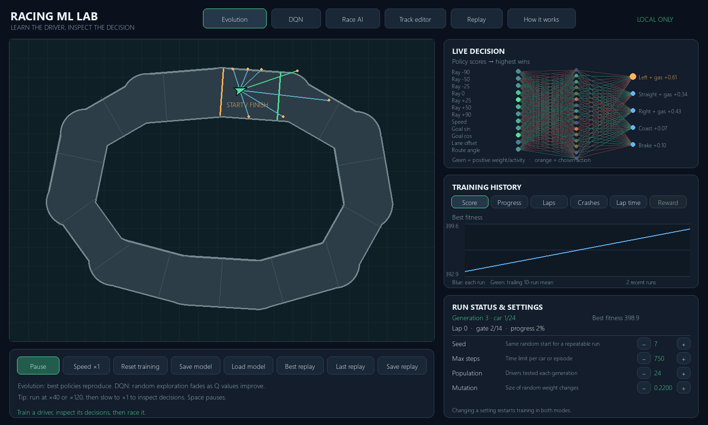
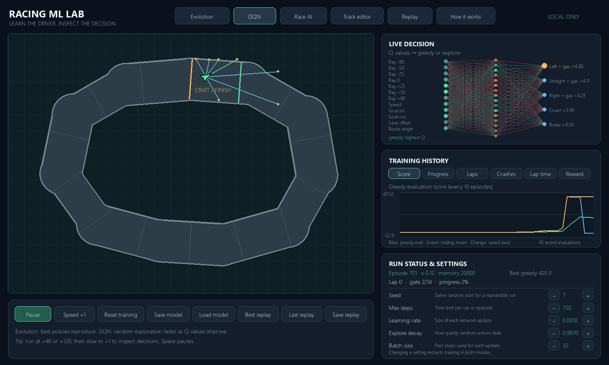
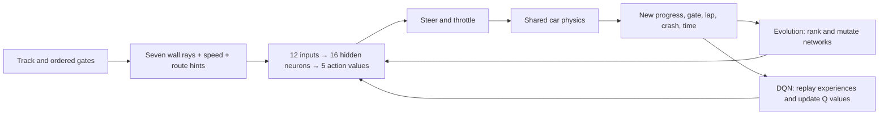

# Racing ML Lab

A local Python desktop simulation for learning **how a car learns**. Watch a 2D driver read sensor rays, choose an action, hit a wall or pass an ordered gate, and improve across runs. Train two independent learners on the same course: an evolutionary neural network and a Deep Q Network (DQN). The app runs locally and has no network connection or GitHub publishing step.





## Start here

Requires Python 3.11–3.13. On Windows PowerShell:

```powershell
cd racing-ml-lab
python -m venv .venv
.\.venv\Scripts\python.exe -m pip install -r requirements.txt
.\.venv\Scripts\python.exe run.py
```

On macOS or Linux, replace `.\.venv\Scripts\python.exe` with `./.venv/bin/python`. The display is 1500 × 900 pixels. The only runtime dependencies are NumPy and pygame-ce; `pytest` is needed for the tests.

Start on **Evolution**, choose speed ×40 or ×120, and watch several generations. Switch to **DQN** and let it run longer: its initial random exploration is deliberate. Return to speed ×1 to see the rays, hidden neurons, scores, and selected action at each step. Use **How it works** for an in-app summary.

## The system at a glance



The seven blue/green rays report free road ahead at −90°, −50°, −25°, 0°, +25°, +50°, and +90°. The other five inputs are speed, sine/cosine of the angle to the next gate, signed distance from the road centerline, and angle relative to the local road direction. These last inputs are *route hints* supplied by the simulation; they make the driving task learnable without hiding information from one algorithm. Both learners see the same 12 numbers.

The five outputs correspond to **left + gas, straight + gas, right + gas, coast, and brake**. In evolution, a score simply ranks those actions; the greatest score wins. In DQN, each number estimates the discounted future reward (a **Q value**) of taking that action. During training DQN sometimes chooses a random action instead, controlled by ε (epsilon). The orange output is the *action actually taken*, including random exploration.

### What counts as improvement?

The car must cross gates **in order and in the forward direction**. Crossing gate 3 before gate 2 earns no checkpoint. A lap is recorded only after every gate and then the start/finish gate. Forward-progress reward is given only when the car reaches a new furthest distance within its current gate interval. Reversing or oscillating cannot repeatedly collect it. A crash ends the run. A step has a small time cost, so sitting still is not an attractive solution.

The DQN reward for each step is `0.025 × new distance + 4 × crossed gate + 40 × completed lap − 0.012 − 8 if crashed`. The **evaluation score**, used to compare final drivers, is separate: `100 × cumulative progress in laps + 100 × completed laps − 0.015 × steps − 5 if crashed`. The extra lap term rewards fully finished circuits. Evolution selects parents using the evaluation score. These numbers are design choices, not universal ML rules; change them in `racing_lab/simulation.py` and observe what happens.

## The two learners

| | Evolution | DQN |
|---|---|---|
| Unit of training | A population of complete policies | One policy updated from individual steps |
| Feedback | Whole-run score | Step reward and predicted future value |
| Exploration | Mutated weights in offspring | Random actions with probability ε |
| Memory | The best parents and best replay | A buffer of 20,000 transitions |
| Update | Copy two elites; mutate selected parents | Sample a batch, calculate target Q values, backpropagate |
| Typical pace here | Several generations can produce laps | Hundreds of episodes may be needed |

Evolution starts with random networks. After every car in a generation finishes, it keeps the top two unchanged. The rest are mutations of networks selected from the best quarter. This is a deliberately simple genetic algorithm: there is no crossover, and the full neural-network weights are the genome.

DQN stores `(state, action, reward, next state, done)` after each step. Every fourth step, it samples old transitions, computes a target from a periodically copied **target network**, and updates the online network with a clipped-error gradient. It discounts future rewards by 0.97. ε begins at 1, multiplies by 0.997 after each episode, and stops at 0.05. Every tenth episode is followed by a separate **greedy evaluation** without random actions or weight updates. The saved "best" network and replay come from these evaluations, so a lucky exploratory episode cannot masquerade as a capable deployable driver. At the default settings, DQN may take roughly 600 or more episodes to complete laps. That is a learning curve, not an app freeze. The chart is more useful than a single lucky run.

### Reading the dashboard

- **Track:** blue/green rays measure wall distance, orange dots mark where rays end, green marks the next gate, and red marks a crash.
- **Network:** the left column is the 12 sensor inputs, the middle is 16 hidden activations, and the right is the five action values. Green/red wires indicate the signs of current weights during training. Replay shows recorded activations and actions; its wire colors are neutral because weights at every replay frame are not stored.
- **Training history:** blue is each generation or episode; green is a trailing 10-run mean. DQN's score chart uses greedy evaluations every tenth episode, with an orange line for the best saved checkpoint; its other charts show exploratory training episodes. Select score, progress, lap completion, crash rate, best lap time, or DQN reward. An empty lap-time graph means no completed lap yet. DQN can improve and later regress, which is why the best evaluated network is saved separately.
- **Run status:** current generation/car or episode/ε/replay-memory size, progress, gates, and learning settings. Changing a setting resets both learners so subsequent comparisons use the same track and seed.

## Make a track, race, and inspect a replay

1. Choose **Track editor**. Drag existing points or choose **Clear** and click at least five points around a closed route. The first point is the start. Select another point and choose **Set start** to move it. Right-click a point to remove it.
2. Choose **Gate tool** and click on the road to add a gate; right-click a gate to remove it. If you leave gates on automatic, they are evenly spaced. The start gate always stays at position zero. Adjust width with **Width −/+**. Choose **Apply track** to validate and train on it. **Save/Open** use JSON files.
3. Train a driver, then choose **Race AI**. Use arrow keys or WASD. Cars are ghosts to each other: they race the track but do not collide with each other.
4. Choose **Best replay** to study the strongest recorded run or **Last replay** to inspect a recent crash. Pause, play, or move one or 60 frames at a time. **Save replay** saves whichever type you last selected. **Open replay** loads a saved JSON recording with its track and settings.
5. **Save model** writes a compressed `.npz` with network weights, algorithm, seed, settings, training track, and best score. **Load model** keeps the *current* track so you can race a saved driver on a different course. The source track stays in the model metadata; a score from that source track is not presented as an evaluation of the new track. Its replay memory is fresh when training resumes.

Two sample tracks are in `data/tracks/`: **Foundry Loop** is the default training track and **Harbor Loop** is an alternate course for evaluation. To test transfer, train and save on Foundry Loop, apply Harbor Loop in the editor, load the saved model, then race. If performance falls, the driver may have learned that particular course rather than a general driving rule. This is the simulation counterpart of evaluating your stock-ranking model on a quarantined holdout instead of its training data.

## Small experiments to try

1. **Exploration:** predict what happens if ε decays faster or slower. Change **Explore decay**, then compare lap-completion curves using the same seed and enough episodes.
2. **Mutation:** try 0.04 and 0.40. Does low mutation refine an existing skill but limit discovery? Does high mutation disrupt good drivers?
3. **Track transfer:** train on Foundry Loop and race the saved model on Harbor Loop. Compare training score with new-track progress. Do not judge from one race alone.
4. **Sensors:** temporarily remove route hints in `Car.observation()` while keeping input dimensions consistent. Predict which method has more difficulty and why.
5. **Reward:** change the crash penalty or new-progress reward, retrain with the same seed, and check both lap completion and crash rate. One metric alone can give a misleading picture.

For a headless CSV experiment:

```powershell
.\.venv\Scripts\python.exe scripts\benchmark.py --mode evolution --runs 30 --csv data\evolution.csv
.\.venv\Scripts\python.exe scripts\benchmark.py --mode dqn --runs 800 --csv data\dqn.csv
```

`--seed`, `--max-steps`, `--population`, `--epsilon-decay`, and `--track` are available. A CSV makes it easier to compare learning curves without relying on visual impressions. Exact times depend on the computer; the seed makes initial weights and action sampling repeatable, but other machines and NumPy versions can produce small numerical differences.

See [the measured baseline experiment](docs/experiment-notes.md) for raw results, a first lap milestone, and the difference between exploratory training and greedy evaluation.

## Code tour

| File | Read it for |
|---|---|
| `racing_lab/track.py` | Track validation, road mask, ray casting, gates, progress |
| `racing_lab/simulation.py` | Car physics, observations, rewards, crash and lap rules |
| `racing_lab/network.py` | Forward pass, mutation, DQN backpropagation, model storage |
| `racing_lab/learning.py` | Evolutionary selection, DQN replay buffer, target network |
| `racing_lab/app.py` | Pygame UI, live graphs, editor, races, and replay controls |
| `scripts/benchmark.py` | Reproducible training outside the graphical app |
| `tests/test_simulation.py` | Behavioral checks for the rules that matter most |

Start reading `Car.observation()`, then `Network.forward()`, then each trainer's `tick()`. In DQN, `train_dqn()` writes the gradient calculation explicitly in NumPy rather than hiding it in a deep-learning framework. That makes it slower than a large PyTorch system, but much easier to understand line by line.

## Verification and limits

Run tests with:

```powershell
.\.venv\Scripts\python.exe -m pip install pytest
.\.venv\Scripts\python.exe -m pytest -q
```

The app is a teaching simulator, not a realistic vehicle dynamics model. Steering, acceleration, and wall collision are intentionally simple. The car has route hints; a real camera-only car would need to infer those. Tracks are single, non-crossing loops of constant width. The editor checks basic geometry, but closely parallel road segments can still overlap visually. Replays store observed values and actions, not every historical weight matrix. The two methods share an environment but use different update rules and feedback granularity, so a direct score comparison is informative but not a claim that one algorithm is universally better.

No data or model files are uploaded by the app. `data/models/` and `data/replays/` are ignored by Git; share them deliberately if you choose to publish an experiment.
